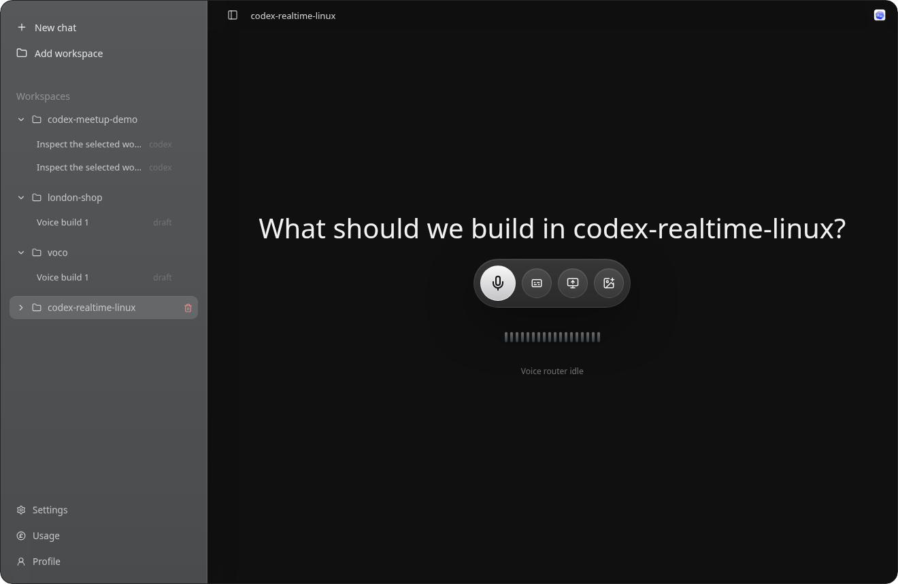

# Codex Realtime Linux

An Electron app for a Linux-first, realtime voice Codex client.

This app explores a voice-led interaction model for Codex: the user speaks, shares screen or image context, interrupts direction naturally, and the Codex execution layer works behind the scenes. The UI is intentionally desktop-like: workspace navigation on the left, nested agent conversations inside each workspace, and a collaborative voice control surface in the center.

This is an independent prototype. It does not reverse engineer the closed Codex Mac app internals.



## Solution Overview

The current solution is a standalone Linux desktop app with a realtime voice-first center surface. The primary flow is deliberately minimal: start voice, add transcript/screen/image context when needed, and while voice is live switch to mute and stop controls. Codex work runs through the app-server bridge in the selected workspace, while generated HTML presentations and previews are written under that workspace and rendered inside the app browser preview.

## Current Shape

- Electron desktop shell for Linux.
- Realtime API over WebRTC for live voice.
- Minimal voice control surface: idle mode offers voice plus optional context actions; live mode offers transcript, mute/unmute, and stop.
- Live transcript panel for the current Realtime session; it opens empty until the active voice session emits transcript events.
- Responses API vision bridge for image uploads and screen snapshots.
- Current weather lookup via Open-Meteo, available to the Realtime voice tool flow and from Settings.
- Ubuntu USB watcher for Arduino-style serial boards; when a board is connected during a live voice session, Codex notices and responds out loud.
- Arduino upload path through `arduino-cli` for safe onboard LED sketches and explicit custom sketches.
- `codex app-server` bridge for Codex agent conversations, events, approvals, apps, models, and auth state.
- Voice-first center workflow with no typed composer in the primary path.
- Collapsible workspace folders with nested agent conversations.
- No-text workspace creation through a folder picker, then voice-led thread creation inside the selected workspace.
- Open agent conversations as separate center windows with independent content.
- Persisted local sidebar state for added workspaces and voice-created agent conversations.
- Codex app-server thread history is merged into matching workspace folders when available.
- Optional transcript view for voice conversations; hidden by default.
- Settings, Usage, and Account details as dedicated system screens.
- Screen sharing and image attachment as context surfaces.
- Spending view with live data when the right API keys are present, shown in GBP.

## Run

```bash
npm install
cp .env.example .env
npm run dev
```

`npm run dev` starts:

- API server on `http://127.0.0.1:3311`
- Vite renderer on `http://localhost:5173`
- Electron desktop shell loading the local renderer

The Vite dev server proxies both `/api` and `/workspace-artifacts` to the local API server so generated previews behave the same in dev and in the installed desktop app.

For browser-only development:

```bash
npm run dev:browser
```

## Install Desktop App

To add Codex to the Linux app menu and launch it by clicking the app icon:

```bash
npm install
npm run install:desktop
```

The installer builds the renderer, installs the desktop entry at `~/.local/share/applications/codex-realtime-linux.desktop`, installs hicolor app icons, and writes `scripts/launch-desktop.sh`. If `XDG_DATA_HOME` is set to an absolute path, the desktop entry and icons use that data root; relative `XDG_DATA_HOME` values are ignored and fall back to `~/.local/share`. The launcher prefers Electron's packaged Linux executable instead of the Node-based Electron shim, and Electron starts the local API server through its own runtime so app-menu launches do not depend on a wide shell `PATH`.

After installation, open the app menu and launch **Codex**. The launcher starts Electron directly; before launch it rebuilds the renderer when `src`, app-owned files in `public`, `index.html`, package, Vite, or TypeScript config files are newer than `dist/index.html`, so double-click launches do not keep serving stale UI after source updates. Generated workspace artifacts under `public/agent-files/` are ignored by this stale-build check so presentations do not become app-shell inputs when this repo is selected as a workspace. Electron starts the local API server and loads the built app from `http://127.0.0.1:3311`; production app-menu launches ignore stale `VITE_DEV_SERVER_URL` values so a leftover dev environment cannot redirect the standalone app away from the built renderer. Linux launches keep the transparent rounded window on a software-rendered path by disabling GPU compositing, rasterization, and accelerated canvas paths before app startup. Electron-managed launches require the local API server to prove it belongs to the current desktop launch. If a previous Electron-managed same-repo server is still on the port, the shell terminates that stale server and starts a fresh one; unrelated or manually started local servers are still refused instead of being reused silently. Launcher failures are written to `~/.local/state/codex-realtime-linux/desktop-launch.log`; each launch writes a timestamped run marker and resolved Electron binary before Electron output. API server output from Electron-managed launches is written to `~/.local/state/codex-realtime-linux/api-server.log`, and startup error dialogs include a bounded tail of that API log when available. If `XDG_STATE_HOME` is set to an absolute path, desktop logs use that state root; relative `XDG_STATE_HOME` values are ignored. Desktop logs rotate at 1 MiB with a `.1` backup.

## Generated HTML Previews

Realtime-generated HTML presentations are written into the selected workspace under `public/agent-files/` and shown in the in-app browser preview when the Codex task finishes in the foreground workspace. The browser preview is temporary and demand-driven: historical artifacts are indexed in the background, but the app does not reopen old previews on startup, workspace navigation, idle polling, or system screens. Browser visibility is tied to the current generated-result session and expires after a 3-minute idle viewing window, so closing the preview, switching workspaces, opening Settings/Usage/Profile, starting another task, or leaving the result idle returns the app to the normal voice surface until a new foreground result is ready. Preview leases are not created while a system screen is open or when the completed artifact belongs to a background workspace. Preview iframe loads and self-refreshes do not renew that viewing window; only explicit interaction with the app preview shell can extend it. Preview routes are workspace-scoped, require a real local workspace path, bound the encoded workspace token, and serve generated files with browser safety headers; the app does not expose a fixed bundled presentation route. The artifact list only includes safe artifact folder names whose `index.html` is a real file inside that artifact folder, so symlink escapes and malformed preview folders are not surfaced to the UI. Codex task responses expose only the generated artifact's relative path, workspace path, and preview URL; internal absolute artifact write paths remain server-only. Individual preview files are capped at 25 MiB before being streamed into the app, and hidden dotfiles or hidden path segments inside artifact folders are not served. Previews are intended to be self-contained local artifacts: scripts may run inside the sandboxed iframe, but network/API connections are blocked by preview CSP, the iframe does not get same-origin privileges, same-origin preview/API routes are not allowed to replace the top-level Electron app shell, and Electron IPC is accepted only from the top app frame.

Codex task routing is also workspace-scoped. The renderer sends the currently selected workspace as `cwd`, and `/api/codex/task` rejects requests that omit a real workspace path instead of falling back to this app's source tree. Realtime voice uses a generic app-source guard, while the server task route creates the per-task artifact path; fixed preview paths are not embedded in the Realtime session prompt.

## API Keys

Live voice requires:

```bash
OPENAI_API_KEY=sk-...
```

For API-key-only Codex execution:

```bash
OPENAI_API_KEY=sk-...
CODEX_USE_OPENAI_API_KEY=true
```

You can also add the OpenAI key from the app itself: open `Settings`, paste the key into `OpenAI API key`, and save. The key is validated against the Realtime API before it is stored locally. A key in `.env` takes precedence over the Settings-saved key.

Use `CODEX_API_KEY` if Codex local execution should use a different key than Realtime voice:

```bash
CODEX_API_KEY=sk-...
```

The app starts Codex through `codex app-server` by default. If your standalone desktop environment cannot resolve `codex` from `PATH`, set the executable explicitly. Blank values and relative path-like overrides are ignored so app-menu launches do not fail later with a confusing spawn error:

```bash
CODEX_BIN=/absolute/path/to/codex
```

Codex task approval defaults to `on-request`. The desktop voice flow does not yet expose an approval UI, so trusted non-interactive workspaces can opt into uninterrupted execution by setting `CODEX_APPROVAL_POLICY=never`; invalid values fall back to `on-request`.

```bash
CODEX_APPROVAL_POLICY=never
```

The desktop app starts the local API server through the Electron runtime by default. If you need to force a separate Node runtime, set it explicitly. The override must be an absolute path; blank or relative values are ignored so app-menu launches do not depend on a desktop shell `PATH`:

```bash
CODEX_REALTIME_NODE_BIN=/absolute/path/to/node
```

The desktop app renderer loads only from a local HTTP origin. `CODEX_DESKTOP_API_URL` is available for development or port overrides, but non-loopback URLs, paths, credentials, query strings, and hashes are ignored:

```bash
CODEX_DESKTOP_API_URL=http://127.0.0.1:3311
```

Codex app-server RPC calls are bounded so the desktop app does not hang indefinitely if the local Codex bridge stalls. Override the timeout only when you have a known long-running local app-server operation. Values must be whole milliseconds from `1000` to `600000`; invalid or larger values fall back to `120000`:

```bash
CODEX_RPC_TIMEOUT_MS=120000
```

OpenAI, admin usage, vision, Realtime token, and exchange-rate HTTP calls are also bounded so startup and settings flows fail cleanly when upstream services stall. Values must be whole milliseconds from `1000` to `120000`; invalid or larger values fall back to `20000`:

```bash
UPSTREAM_FETCH_TIMEOUT_MS=20000
```

Visual context uses the same OpenAI key by default. The app captures uploaded images or a single screen-share frame, analyzes it with the Responses API, then injects the concise summary into the live Realtime conversation when voice is active. Image and screen source labels are reduced to safe basename-style labels before they are sent to prompts, notices, or Realtime. Override the vision model if needed:

```bash
VISION_MODEL=gpt-5.4
```

Realtime voice defaults to the configured Realtime model and voice, and its persona/user context is controlled by environment variables. These runtime strings are trimmed, whitespace-normalized, and bounded before they are exposed through status or sent to Realtime. If `REALTIME_USER_NAME` is not set, the server uses the OS username; location is omitted unless you set it.

```bash
REALTIME_MODEL=gpt-realtime-2
REALTIME_VOICE=cedar
REALTIME_TRANSCRIPTION_MODEL=gpt-4o-mini-transcribe
REALTIME_USER_NAME=
REALTIME_USER_LOCATION=
REALTIME_PERSONA=
OPENAI_SAFETY_IDENTIFIER=
```

Realtime client-secret requests include an OpenAI safety identifier. If `OPENAI_SAFETY_IDENTIFIER` is unset, the server derives a stable anonymized value from this local installation instead of sending a fixed global identifier or the raw OS username.

The local API accepts app requests from the desktop origin and Vite dev origins only. To trust another local development origin, add it explicitly. Extra origins must be root `http://localhost`, `http://127.0.0.1`, or `http://[::1]` origins; non-loopback URLs, paths, credentials, query strings, and hashes are ignored. Allowed browser origins receive CORS response and preflight headers for `/api/*`; untrusted origins are rejected before they reach state, Codex, vision, weather, or hardware routes:

```bash
CODEX_REALTIME_ALLOWED_ORIGINS=http://127.0.0.1:6006
CODEX_REALTIME_JSON_LIMIT=25mb
```

JSON limits accept `b`, `kb`, or `mb` units up to `25mb`; invalid or larger values fall back to `25mb`.

Local sidebar state is saved outside the repo by default. Saved state is normalized and bounded on load so stale or oversized local state cannot dominate startup. Writes go through a temp file, file sync, and atomic rename so state updates are durable without exposing partial JSON files. To override it, use an absolute path:

```bash
CODEX_REALTIME_STATE_PATH=/tmp/codex-realtime-linux/app-state.json
```

Relative state paths are ignored and fall back to the default XDG state location.

Settings-saved secrets are also stored outside the repo by default with user-only directory and file permissions, synced atomic writes, an oversized-file guard, and bounded key normalization on load. To override that path:

```bash
CODEX_REALTIME_SECRETS_PATH=/tmp/codex-realtime-linux/secrets.json
```

Relative secret paths are ignored and fall back to the default XDG config location.

Organization spending, project, and admin analytics require:

```bash
OPENAI_ADMIN_KEY=sk-admin-...
```

Without admin scope, Usage shows a clean empty state instead of fabricated numbers. Cost data is displayed in GBP; if OpenAI returns USD, the server converts it with `OPENAI_USAGE_GBP_RATE` or the configured live rate endpoint. Pinned and live USD -> GBP rates must be positive and no higher than `10`; invalid pinned values fall back to the live endpoint, while invalid live responses are surfaced as conversion errors instead of fabricated GBP totals. Mixed-currency cost rows are ignored and reported as a bounded warning. Usage responses return bounded aggregate buckets only; raw admin API payloads are not sent to the renderer.

```bash
# Optional: pin USD -> GBP conversion instead of using the live rate endpoint.
OPENAI_USAGE_GBP_RATE=0.79
# Optional: override the no-key live conversion endpoint.
OPENAI_USAGE_GBP_RATE_API=https://api.frankfurter.app/latest?from=USD&to=GBP
```

## Architecture

- `server/index.mjs` is the local API bridge for Realtime session creation, Codex app-server RPC, workspace discovery, events, spending, and rate limits.
- `/api/status` is the desktop health contract used by the Electron launcher; unexpected status probe failures return bounded JSON errors instead of unhandled responses.
- `/api/weather/current` resolves a place name and returns normalized current weather data without requiring an API key.
- `/api/usb/events` reports Linux USB serial add/remove events with bounded device metadata and bounded monitor status errors, and flags Arduino-like devices.
- `/api/arduino/upload` compiles and uploads sketches with `arduino-cli`; `/api/arduino/status` returns bounded CLI and board metadata, and uploads ignore malformed detected FQBNs before falling back to `ARDUINO_DEFAULT_FQBN=arduino:avr:uno`.
- `/api/vision/context` analyzes image and screen context with Responses vision, then the renderer sends the summary into the active Realtime data channel.
- `/api/codex/task` requires an explicit existing workspace `cwd`; Realtime voice routing only accepts the workspace currently selected in the app.
- `/api/codex/events` returns bounded, normalized Codex app-server notifications for lightweight UI activity tracking.
- Realtime tool-call IDs, arguments, transcript text, final response transcript fallbacks, event records, and function outputs are bounded before they update the UI or travel back over the Realtime data channel.
- Mutating `/api/*` routes reject untrusted browser origins, and routes with JSON payloads reject form-style, malformed, or oversized requests before they can touch state, Codex, or Arduino hardware.
- The built app shell is served with browser safety headers: a CSP limited to app assets, local API calls, and OpenAI Realtime calls; no-sniff and no-referrer headers; anti-framing headers; and permissions policy that allows microphone/display capture only for the app itself. Electron also denies permission checks and requests except media/display capture from the trusted top app frame. Generated artifact previews use a stricter separate CSP that blocks network/API connections.
- The server persists this client's local workspace/thread state to `CODEX_REALTIME_STATE_PATH`, defaulting to `~/.local/state/codex-realtime-linux/app-state.json`; overrides must be absolute paths, the state directory is tightened to `0700`, writes are synced before atomic rename, loaded state is bounded and deduplicated by workspace path and conversation ID, and app-state write failures return bounded JSON errors instead of misleading route-specific failures.
- The server persists Settings-saved API secrets to `CODEX_REALTIME_SECRETS_PATH`, defaulting to `~/.config/codex-realtime-linux/secrets.json`; overrides must be absolute paths, the secrets directory is tightened to `0700`, writes are synced before atomic rename, malformed or oversized saved keys are ignored on load, and Settings responses do not expose the absolute secrets file path.
- The app-menu launcher and Electron API supervisor write startup logs under `~/.local/state/codex-realtime-linux/` with a user-only `0700` directory and `0600` log files before redirecting process output.
- Removing a workspace in the app clears that workspace and its saved local conversation buckets from this client's sidebar state; it does not delete the local folder. Adding the same folder again clears the hidden marker so the workspace becomes visible immediately.
- `src/App.tsx` is the Electron renderer UI.
- `src/App.css` defines the compact dark desktop layout.
- `electron/main.cjs` creates the desktop window. In development it loads the Vite renderer; from the app-menu launcher it starts the local API server and loads the built renderer served by `server/index.mjs`.

## Live Verification Checklist

Automated tests cover routing, persistence, preview policy, API guards, and build correctness. They do not prove microphone permissions, speaker output, app-menu launch behavior, screen capture permissions, or physical Arduino upload success. Use this checklist before treating a release as fully verified.

1. Desktop launch: run `npm run install:desktop`, launch **Codex** from the app menu, then confirm the app opens without a terminal. If launch fails, check `~/.local/state/codex-realtime-linux/desktop-launch.log` and `~/.local/state/codex-realtime-linux/api-server.log`.
2. API health: with the desktop app open, run `curl -s http://127.0.0.1:3311/api/status` and confirm it returns this app root and a healthy local server response.
3. Workspace routing: add a real local workspace folder in the sidebar, select it, and start a voice instruction that creates an HTML presentation from files or images in that workspace. Generated files must land under that workspace's `public/agent-files/` folder, not under this app source tree.
4. In-app browser preview: when the Codex task finishes, confirm the generated presentation opens inside the app preview, can be clicked through like a browser page, and can be closed without leaving a hardcoded viewer behind. Leave the preview idle and confirm it clears after the 3-minute viewing window. Restart the app and switch workspaces; old previews must stay hidden until a new generated result needs to be shown.
5. Subagent activity: while Codex is working, confirm agent activity is subtle and local to the relevant selected workspace area of the app. It must not take over the full window or follow workspace navigation into unrelated contexts.
6. Realtime voice and transcript: start voice, speak, open the transcript, and verify both user and Codex transcript lines appear. Mute, unmute, and stop must work, user-initiated stop must show the normal stopped notice instead of a stale Realtime close error, shorter final transcript events and final response payload fallbacks must not erase text that arrived as deltas, and input transcription failures must appear as bounded transcript errors instead of an empty panel.
7. Visual context: attach an image or share a screen frame while voice is active. Confirm the app reports context collection, sends the visual summary into the conversation, does not carry context captured during an ended voice session into a later session, and does not leave screen sharing stuck on.
8. Weather: enter a real location in Settings or ask by voice, then confirm the result is live data for that location rather than a placeholder.
9. USB detection: with voice running, connect the board and run `curl "http://127.0.0.1:3311/api/usb/events?scan=true"`. The app should briefly acknowledge the detected board without pretending to read sketch or serial data.
10. Arduino upload: run `curl -s http://127.0.0.1:3311/api/arduino/status`, confirm `arduino-cli` is available, then upload a safe onboard LED sketch with an explicit port if auto-detection is ambiguous. Verify the physical board LED changes as instructed.

## Weather Check

Open `Settings` in the app, enter a location, and use `Get weather` to verify the feature in the UI.
Location queries are trimmed, internal whitespace-normalized, and bounded before the Open-Meteo lookup.

You can also hit the local API directly after `npm run dev`:

```bash
curl "http://127.0.0.1:3311/api/weather/current?location=London&units=metric"
```

## Arduino USB Voice Flow

On Ubuntu, the local API watches `udevadm monitor` for USB serial devices such as `/dev/ttyACM0` and `/dev/ttyUSB0`. Start voice, then plug in an Arduino Uno, Nano, Mega, Leonardo, or common CH340/CP210x/FTDI Arduino-compatible board. The renderer cancels the current Realtime response, clears pending output audio, injects the USB connection event into the active conversation, and asks Codex to briefly acknowledge the device without pretending it can read sketch or serial data.

You can verify the watcher directly:

```bash
curl "http://127.0.0.1:3311/api/usb/events?scan=true"
```

If the board appears but later serial reading is needed, add your Ubuntu user to `dialout`, then sign out and back in:

```bash
sudo usermod -aG dialout "$USER"
```

## Arduino Upload Flow

Arduino uploads use `arduino-cli`. Install it, initialise the AVR core for Uno-compatible boards, then restart the app:

```bash
curl -fsSL https://raw.githubusercontent.com/arduino/arduino-cli/master/install.sh | sh
./bin/arduino-cli core update-index
./bin/arduino-cli core install arduino:avr
```

The app automatically looks for `./bin/arduino-cli`; set `ARDUINO_CLI_PATH` if it is installed somewhere else. The override must be an absolute path; blank, relative, overlong, or control-character values are ignored so app-menu launches still fall back to the bundled CLI and then PATH. Set `ARDUINO_DEFAULT_FQBN` to change the default board target:

```bash
ARDUINO_CLI_PATH=/absolute/path/to/arduino-cli
ARDUINO_DEFAULT_FQBN=arduino:avr:uno
```

With voice running and the board connected, say something like: “turn on the Arduino light” or “make the Arduino LED blink”. Realtime calls `arduino_upload_sketch`, the server compiles the sketch, and uploads it to the detected board. For a single detected board, the server prefers a stable `/dev/serial/by-id/*` link when available, falling back to `/dev/ttyACM*` or `/dev/ttyUSB*`. If multiple boards are detected, or if multiple serial ports exist and board metadata cannot identify one target, upload fails until a supported `/dev/ttyACM*`, `/dev/ttyUSB*`, or `/dev/serial/by-id/*` port is supplied explicitly, so the app does not guess and flash the wrong board. Explicit upload ports must be currently detected; stale or arbitrary serial paths fail before compile/upload. When an explicit stable by-id port maps back to a detected tty board, including when more than one tty device is connected, the app uses that board's detected FQBN for compile/upload instead of falling back to the default Uno target. If `arduino-cli` reports multiple candidate board matches for a port, the server prefers a valid FQBN candidate before falling back to the default target.

You can test the API directly:

```bash
curl -X POST http://127.0.0.1:3311/api/arduino/upload \
  -H "Content-Type: application/json" \
  -d '{"action":"onboard_led_on","fqbn":"arduino:avr:uno"}'
```

## Public Codex App Signals Mirrored

Based on public Codex app docs and product pages:

- Codex app is positioned as a command center for multiple agents running in parallel across projects.
- Agent conversations are grouped by workspace and can run in local, worktree, or cloud modes.
- Worktrees isolate parallel work and background automations from the foreground checkout.
- In-app browser supports local/public preview, page comments, and browser-use automation for scoped web QA.
- Computer Use and Appshots provide visual desktop/app context with explicit permissions.
- App-server is the public integration surface for custom clients: agent conversations, turns, approvals, history, auth, apps, models, and streamed events.

The app’s differentiator is replacing the composer-first interaction model with a realtime voice router that supervises Codex execution. Realtime is the conversational layer: it listens, clarifies intent, and decides whether the user is chatting, starting work, steering active work, or interrupting work. The Codex app-server harness is the execution layer: it owns coding threads, turns, approvals, history, and streamed agent events. Visual inputs are bridged into voice as summarized context rather than streamed as continuous video.

## Next Milestones

- Stream Codex app-server turn output into the center conversation instead of summary cards.
- Upgrade visual context from single-frame snapshots to continuous multimodal Realtime when the product needs live video understanding.
- Add packaging for Linux AppImage or deb.

## Sources

- https://openai.com/index/introducing-the-codex-app/
- https://openai.com/codex/
- https://developers.openai.com/codex/app
- https://developers.openai.com/codex/app/features
- https://developers.openai.com/codex/app/worktrees
- https://developers.openai.com/codex/app/browser
- https://developers.openai.com/codex/app/computer-use
- https://developers.openai.com/codex/appshots
- https://developers.openai.com/codex/app-server
- https://developers.openai.com/api/docs/guides/realtime-webrtc
